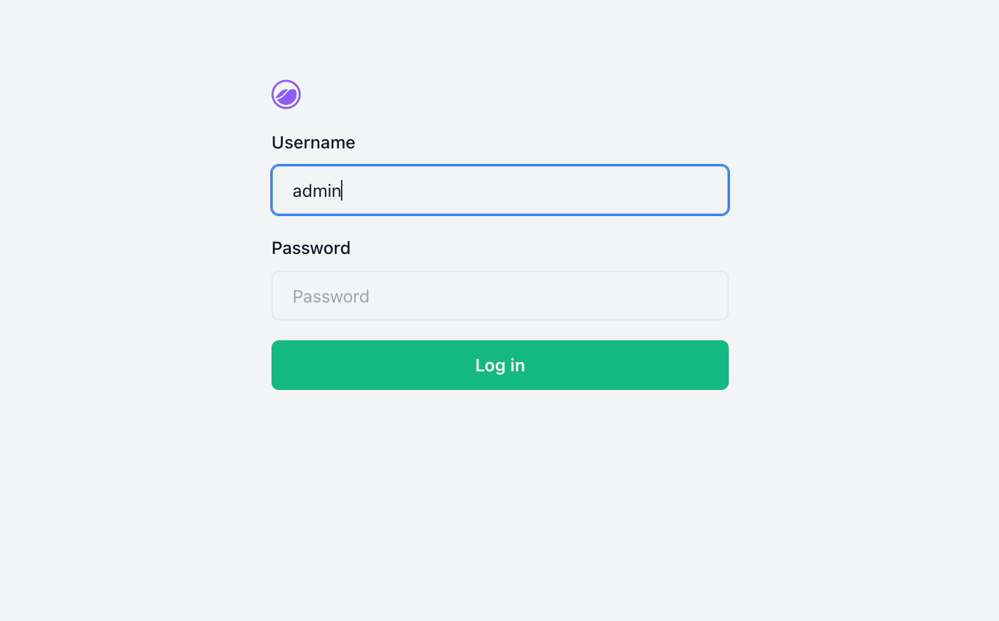
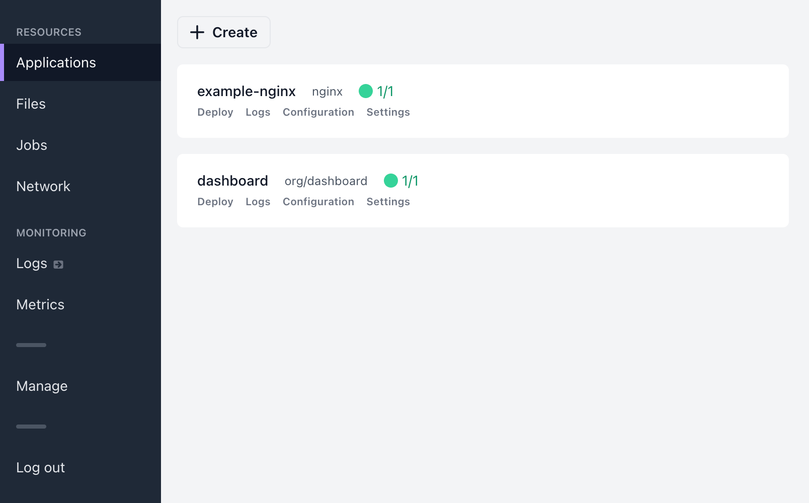
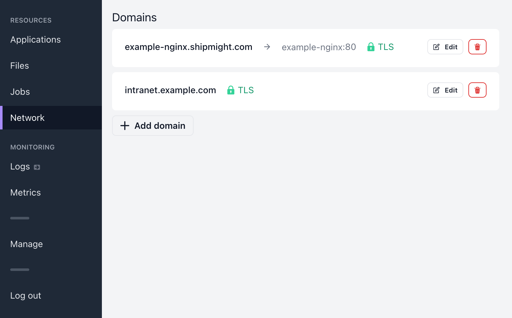
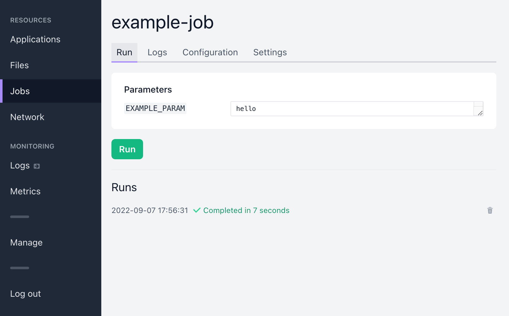
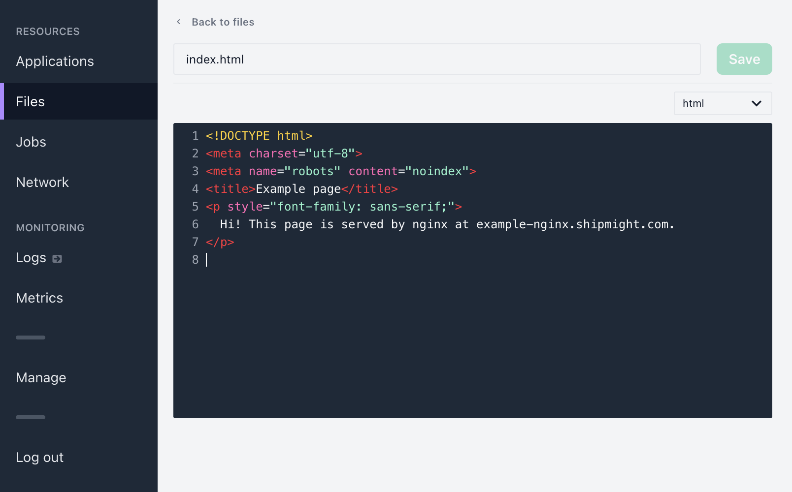
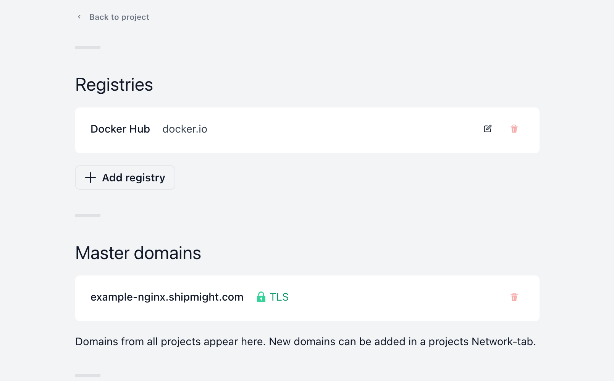
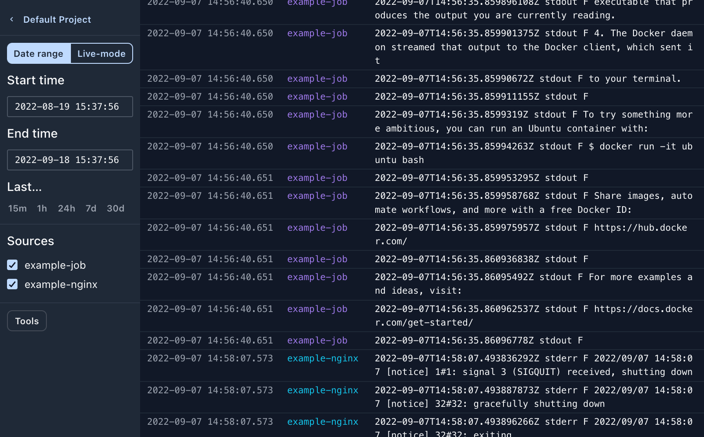
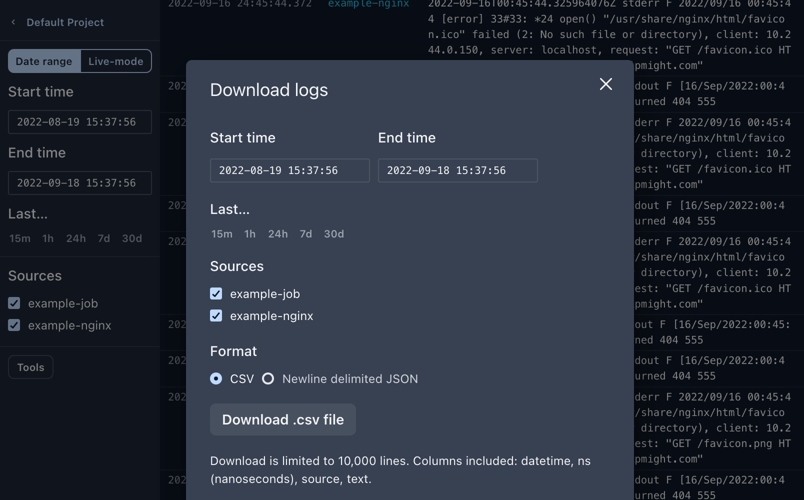

       

# PaaS in your cloud

Shipmight is a Developer Platform which runs on any Kubernetes cluster.

Install via Helm on your cloud of choice.

[Home](https://shipmight.com)     [Docs](https://shipmight.com/docs)     [GitHub](https://github.com/shipmight)     [Twitter](https://twitter.com/shipmight)

## Features

- **Install Shipmight anywhere.** Install on any Kubernetes cluster via our official Helm chart.
- **Deploy containerized applications.** With horizontal (replicas) and vertical (memory, CPU) scaling. Pull images from public and private registries. Manage and mount configuration files in-browser. Set environment variables.
- **Easy domains & SSL.** One-click connect domains to applications. Automatic SSL via Cert-Manager & Lets Encrypt.
- **Deploy containerized jobs.** Trigger runs manually or via webhook. Define job parameters for each run.
- **Browse and download logs.** Browse live and historical logs in an embedded log viewer. Download as CSV/NDJSON.
- **Integrate with the ecosystem.** Grafana Loki for log collection. Ingress-NGINX for ingress management. Cert-Manager for SSL issuance.
- **Scale with your cluster.** No stateful database, Shipmight uses the in-cluster etcd as its data store.
- **Reproduce your infra locally.** Run Shipmight on minikube or equivalent local cluster.
- **Update with a button.** Shipmight updates itself.
- **And more.** See [documentation](https://shipmight.com/docs) and [live demo](https://demo.shipmight.com).

## Getting started

### Requirements

See [Docs → Requirements](https://shipmight.com/docs/requirements).

### Installation

See [Docs → Installation](https://shipmight.com/docs/installation).

#### TL;DR:

Minimal installation:

```bash
helm repo add shipmight https://shipmight.github.io/helm-charts
helm repo update
helm install shipmight shipmight/shipmight-stack \
  --namespace shipmight \
  --create-namespace
```

Full stack:

```bash
helm repo add shipmight https://shipmight.github.io/helm-charts
helm repo update
helm install shipmight shipmight/shipmight-stack \
  --namespace shipmight \
  --create-namespace \
  --set cert-manager.enabled=true \
  --set promtail.enabled=true \
  --set loki.enabled=true \
  --set loki.config.storage_config.aws.s3=s3://<access-key>:<secret-access-key>@<s3-endpoint>/<bucket-name> \
  --set shipmight.config.lokiEndpoint=http://shipmight-loki:3100
kubectl create -f your-cluster-issuer.yaml
```

## Documentation

Browse HTML documentation at **[shipmight.com/docs →](https://shipmight.com/docs)**

The documentation is generated from Markdown files under the directory [`docs/`](docs/).

## Questions and answers

### Is Shipmight production-ready?

Shipmight is basically a UI for Kubernetes. When Shipmight users deploy apps, they are created as regular Kubernetes workloads in the cluster. Therefore your workload deployments are as production-ready as your cluster is.

Shipmight itself is in early development and lacks many features we have planned. At this early stage, we would recommend using Shipmight for hosting internal tools at your company.

### Does Shipmight scale?

Shipmight uses etcd as its data store, by managing resources via the Kubernetes API (some entities in Shipmight correspond to Kubernetes resources like deployments or jobs, some are stored simply as Secrets). In terms of storage, Shipmight scales with your cluster.

If the question is from the perspective of an user who is deploying apps in Shipmight: you can define horizontal and vertical scaling for your apps straight from the UI.

### How much Kubernetes experience is necessary to operate Shipmight?

You should feel comfortable maintaining a Kubernetes cluster in the long term.

(Btw, if you are a solo developer or an early stage startup: you are looking in the wrong place. Don't self-host anything! Use managed services for everything and focus on developing your own product/service. Speaking from experience.)

### Where should I host databases and other stateful services?

At the moment Shipmight is fully ready to host stateless apps, but it's not very well suited for stateful services like file-backed databases. For the time being we recommend using the managed database service provided by your cloud of choice.

In the future Shipmight will enhance in this regard.

## Contributing

See [CONTRIBUTING.md](CONTRIBUTING.md).

## License

Released under GNU AGPLv3, see [LICENSE](LICENSE).

It is a permissive open source license. Paraphrased, it allows you to use the software freely as long as you don't make a modified or derivative work available to others (including over a network), unless that work is also released publicly under the same license.

Paraphrased and not exhaustive (see license text for exact terms), you are allowed to:

- Use the software for commercial and non-commercial purposes
- Maintain a private and modified fork for your own private use

Paraphrased and not exhaustive (see license text for exact terms), you are not allowed to:

- Maintain a private and modified fork for use by others
- Maintain a private and modified fork for use by others over a network

---

[Home](https://shipmight.com)     [Docs](https://shipmight.com/docs)     [GitHub](https://github.com/shipmight)     [Twitter](https://twitter.com/shipmight)     *Don't reinvent the ship*
