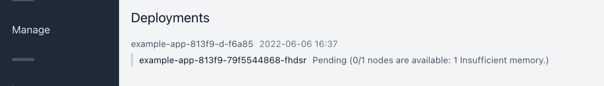

# Applications

Applications are what you, the user, deploys on Shipmight.

You can route HTTP traffic to applications, but it is entirely optional.

## Listing applications

On the **Applications** page you can view a list of all applications in the project.

## Creating applications

On the **Applications** page, select **Create application**.

See [Fields](#fields) below for available fields.

Creating an application does not immediately deploy it. See [Making a deployment](#making-a-deployment) below.

## Fields

Available fields for applications:

- **Name**  
  Descriptive name for the application.

- **Image registry**  
  See [Registries](Registries.md).

- **Image name**  
  Name of the image to pull for this application.

- **Environment variables**  
  See [Environment variables](Environment-variables.md).

- **File mounts**  
  See [Files](Files.md).

- **Replicas**  
  See [Scaling](Scaling.md).

- **Memory**  
  See [Scaling](Scaling.md).

- **CPU**  
  See [Scaling](Scaling.md).

## Making deployments

On the **Release** tab you can deploy the application.

Initially the deployment list is empty:

Select a specific tag to deploy:

> **Note:** In many articles online you may see the tag `latest` used instead. While this is quick and works, it is discouraged. You should always use a precise version, as recommended by [Kubernetes](https://kubernetes.io/docs/concepts/containers/images/#image-pull-policy).

After selecting **Deploy**, a new deployment will appear in the list below:

You can follow the container and pod statuses in real-time. When the deployment is ready, it should look something like this:

If Kubernetes reports any issues (for example, insufficient memory or CPU resources, or trouble pulling the image), you’ll see this information in the list as well:

## Viewing application logs

See [Logs](Logs.md).

## Routing traffic to applications

See [Domains and SSL](Domains-and-SSL.md).

## Editing applications

On the **Configuration** tab you can edit the configuration of an existing application.

Note that changes will not be effective until you make a new deployment.

## Deleting applications

On the **Settings** tab you can delete the application.

## Kubernetes resources

Behind the scenes the application is stored as a Kubernetes Secret.

When a deployment is made, Shipmight deploys it as a Helm release.
