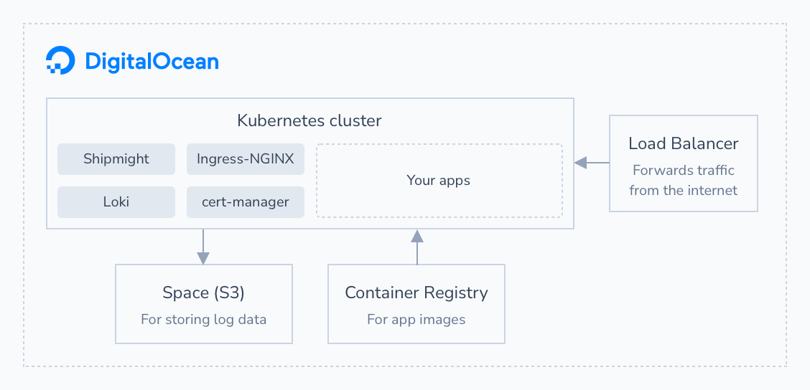

# Shipmight on DigitalOcean (DOKS)

This page contains helpful information about hosting Shipmight on [DigitalOcean](https://digitalocean.com) Kubernetes (DOKS).

Example Shipmight architecture on DigitalOcean:



## Cost example

> **Note:** Always refer to official [DigitalOcean pricing information](https://www.digitalocean.com/pricing) for accurate prices. The pricing information on this page is not guaranteed to remain accurate.

Your costs will vary based on the size of your cluster. Below we've compiled an example breakdown of a small Shipmight cluster. It can be used to get an idea of how much it costs to get started.

Estimated example costs of a small Shipmight cluster on DigitalOcean, at the time of writing:

| Resource                      | Price  | Amount | Total      |
| ----------------------------- | ------ | ------ | ---------- |
| Space (for log storage)       | $5/mo  | 1      | $5/mo      |
| Container Registry            | $5/mo  | 1      | $5/mo      |
| Kubernetes node (4GB / 2vCPU) | $20/mo | 2      | $40/mo     |
| Load Balancer                 | $10/mo | 1      | $10/mo     |
| **Total**                     |        |        | **$60/mo** |

Accounting for internal Kubernetes pods and pods of Shipmight stack, this node group configuration leaves approximately 1.5GB and 2.5vCPU for your apps.

Note that you may want to add more nodes and/or turn on auto-scaling in the future, if you want to scale up your cluster.

## Things to note

### Kubernetes version

When creating a cluster, make sure to select a version that's supported by Shipmight. See [Requirements](Requirements.md).

### Metrics Server

You should not enable Metrics Server when installing the Shipmight stack. Instead install the preconfigured [Metrics Server from DigitalOcean Marketplace](https://marketplace.digitalocean.com/apps/kubernetes-metrics-server).

## DigitalOcean architecture

### Using DigitalOcean Spaces with Loki

You can configure Loki to store logs in a DigitalOcean Space, which is DigitalOceans S3-compatible product offering.

Example Loki configuration:

```bash
helm upgrade shipmight shipmight/shipmight-stack \
  --set loki.config.storage_config.aws.endpoint=<region>.digitaloceanspaces.com \
  --set loki.config.storage_config.aws.bucketnames=<space-name> \
  --set loki.config.storage_config.aws.access_key_id=<access-key> \
  --set loki.config.storage_config.aws.secret_access_key=<secret-key>
```

To obtain `<access-key>` and `<secret-key>`, create a **Space access key** under **API** → **Tokens/Keys** → **Spaces access keys**.

### Using DigitalOcean Container Registries in Shipmight

You can store app images in DigitalOcean Container Registries.

After creating a registry, make it available to your cluster under **Settings** → **DigitalOcean Kubernetes integration**.

Then simply add it as a registry under Manage, as instructed in [Registries](Registries.md).

When Shipmight asks for the repository URL, paste in the repository URL which you can find under the repository name in DigitalOcean dashboard. Its format should be similar to this: `registry.digitalocean.com/<unique-registry-id>`

You can leave **Auth token** empty, because you enabled access to the registry from your cluster.

### Load balancer

When you install Shipmight into the cluster, a `LoadBalander` resource is created (by Ingress-NGINX). It will result in a new load balancer created on your DigitalOcean account. You should not edit or delete this load balancer manually, as it is managed by the Kubernetes cluster.

The IP address of the load balancer forwards traffic to your cluster. Domains should be pointed at this IP address.

For example, by default you can access the Shipmight UI at `http://<load-balancer-ip>/shipmight`.
