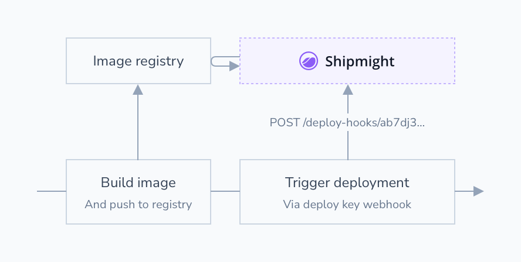
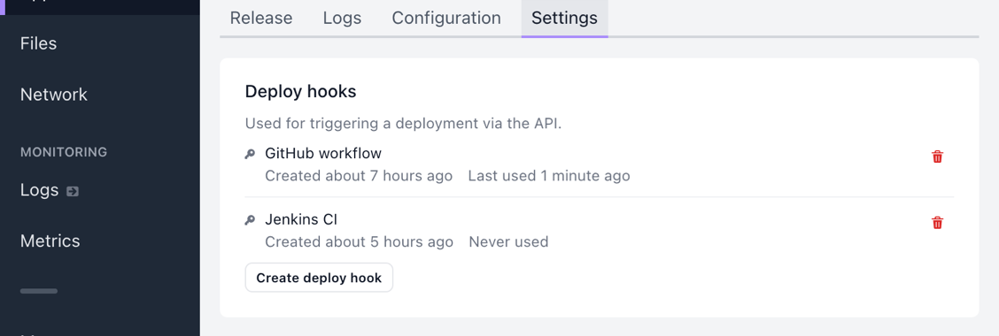

# Deploy hooks

Trigger a deployment of an app via a HTTP request.

## How it works

Deploy hooks are unique URLs which can be used to trigger a new deployment for an app. They can be used in CI flows to automatically release new versions of the app.



Triggering a deployment via a deploy hook achieves the same as making a manual deployment via the UI.

### Example GitHub workflow

Here's a sample GitHub workflow which implements this flow by pushing an image to GitHub Container Registry and triggering a new deployment:

```yaml
name: Deploy
on:
  - push
jobs:
  image:
    runs-on: ubuntu-latest
    steps:
      - uses: actions/checkout@v2
      - name: Store commit ref
        run: echo "SHORT_SHA=`git rev-parse --short HEAD`" >> $GITHUB_ENV
      - name: Build and push image
        run: |
          docker build -t ghcr.io/<username>/<imageName>:${{ env.SHORT_SHA }} .
          echo ${{ secrets.GITHUB_TOKEN }} | docker login ghcr.io -u <username> --password-stdin
          docker push ghcr.io/<username>/<imageName>:${{ env.SHORT_SHA }}
      - name: Trigger deployment
        run: |
          curl \
            -X POST \
            -H 'Content-Type: application/json' \
            -H 'X-Deploy-Hook-Token: ${{ secrets.DEPLOY_HOOK }}' \
            --data '{"imageTag":"${{ env.SHORT_SHA }}"}' \
            https://<shipmight-url>/api/v1/dh
```

## Creating deploy hooks

You can find deploy hooks under your app settings:



Selecting **Create deploy hook** opens a modal where you’ll be able to select:

- **Name**  
  Descriptive name for the hook. Used for presentational purposes only. It’s recommended to include information about where and by whom this hook is used. Cannot be changed later.

After creating the key you’ll be able to copy the unique hook token which is used in the HTTP request URL. This is the only time you can copy this token. If you lose it, you can simply create a new hook and delete the old one.

Deleting a deploy hook invalidates it immediately, so any further requests to it begin failing.

## Trigger a deployment via a HTTP request

The endpoint URL is:

```
POST /api/v1/dh
```

Request headers must contain the hook token:

```
X-Deploy-Hook-Token: <deploy-hook-token>
```

Request body must contain the new image tag to deploy:

```json
{
  "imageTag": "<tag>"
}
```

### Examples

Example curl request for an application:

```bash
curl \
  -X POST \
  -H 'Content-Type: application/json' \
  -H 'X-Deploy-Hook-Token: <deploy-hook-token>' \
  --data '{"imageTag":"1.2.0"}' \
  https://<shipmight-url>/api/v1/dh
```

Example curl request for a job:

```bash
curl \
  -X POST \
  -H 'Content-Type: application/json' \
  -H 'X-Deploy-Hook-Token: <deploy-hook-token>' \
  --data '{"instanceEnvironmentVariables":[{"name":"EXAMPLE_VAR","value":"example"}]}' \
  https://<shipmight-url>/api/v1/dh
```

### Response status codes

The following status codes are supported:

- `201` Deployment was triggered successfully
- `400` Malformed request or validation error
- `404` Deploy hook was not found
- `500` Unknown error happened
