# Deploy single HTML page

While Shipmight works well for more complicated deployment setups, you can also use it as a toolkit for more minimal deployments, such as a single HTML page. For example, this way you can easily set up a placeholder page for your domain.

This tutorial whill show you how to:

- create and update a file in Shipmight
- create and deploy an application which will serve the HTML file, using [the official nginx image](https://hub.docker.com/_/nginx) from Docker Hub
- create a domain and point it to the application

Here’s an overview of the resulting architecture:

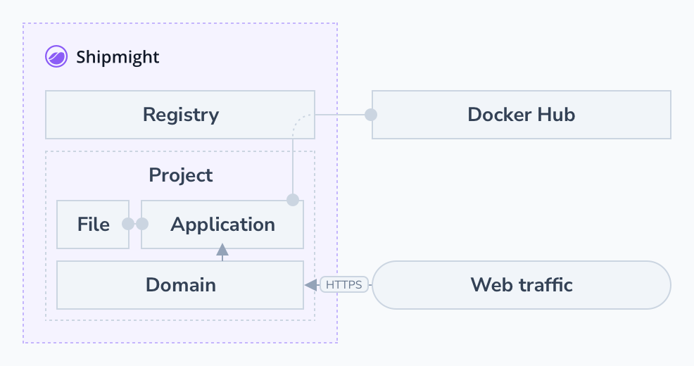

## Prerequisites

You should have a Shipmight installation ready.

Estimated time to complete this tutorial: 10 minutes

## Create HTML file

From the sidebar, navigate to **Files**.

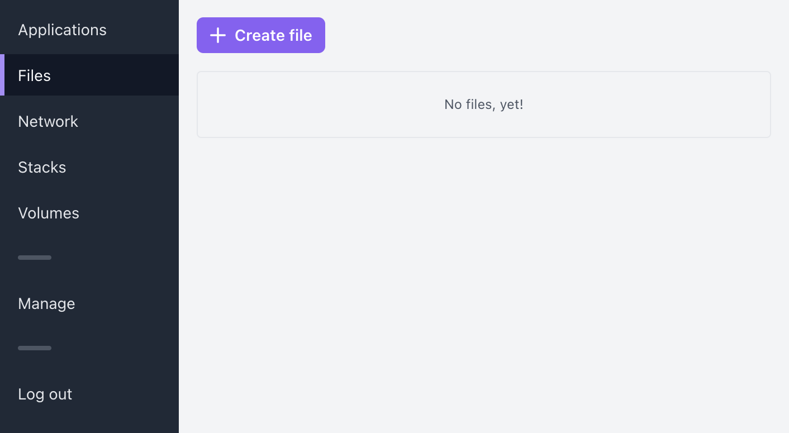

Select **Create file**.

Give the file a name, for example `tutorial.html`, and type in some HTML content.

> **Note:** The filename you select at this step is just for presentational purposes. You will be able to choose a different filename and path when mounting the file into an application.

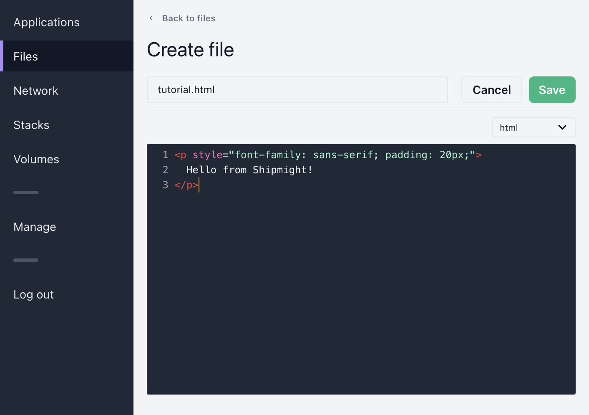

If you want, you can paste in this boilerplate example:

```html
<p style="font-family: sans-serif; padding: 20px;">Hello from Shipmight!</p>
```

Then select **Save**.

After saving you should see a new file under **Files**.

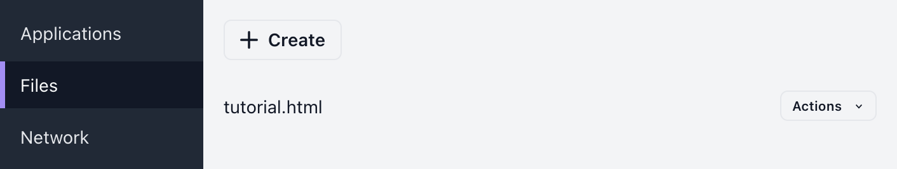

## Create application

Navigate to **Applications** from the sidebar and select **Create application**.

Fill in the following details:

- **Name**  
  Give the application a name, for example `tutorial-nginx`.

- **Image registry**  
  Select “Docker Hub”.

- **Image name**  
  Type in `nginx`.

Here’s an example of what the top of the form should look like with these details filled in:

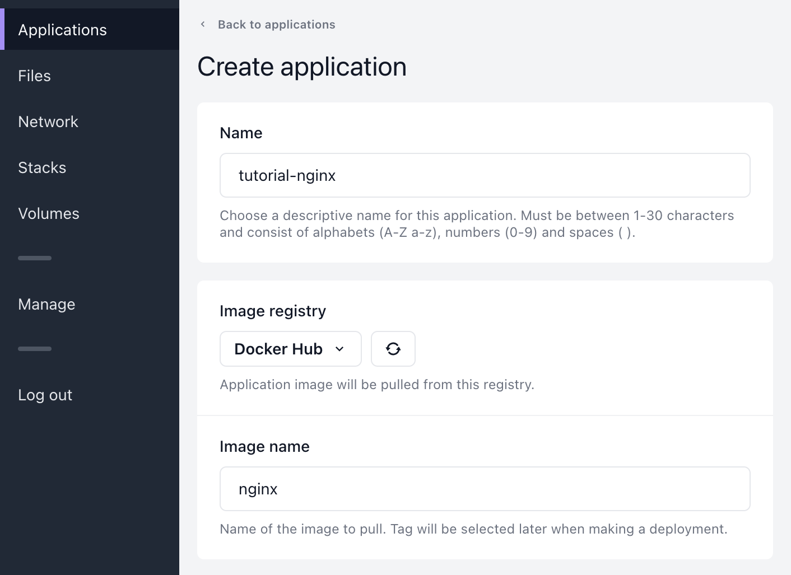

Next, under **File mounts**, select the previously created HTML file from the dropdown.

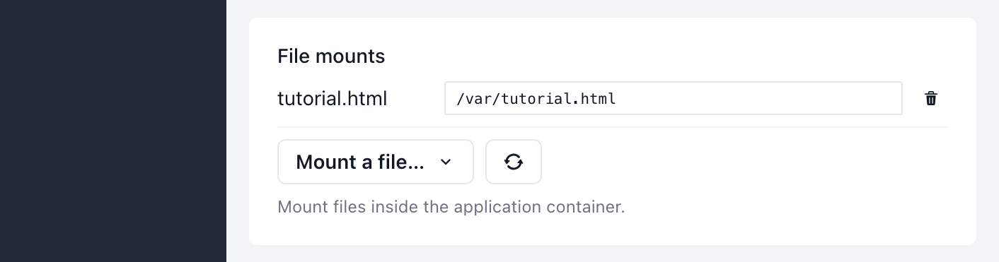

Then type in the mount path `/usr/share/nginx/html/index.html`, which is the location of the default index page for Nginx.


Then select **Create application**. You will be redirected to the Release-tab of the newly created application.

## Deploy application

In the **Image tag** field on the Release-tab, type `1.21.5`.

> **Note:** In similar tutorials you may see the tag `latest` used instead. While this works, it is discouraged. You should always use a precise version, as recommended by [Kubernetes](https://kubernetes.io/docs/concepts/containers/images/#image-pull-policy).

Then select **Deploy**.

You should see a new deployment appear at the bottom of the page.


Wait until the deployment has finished. It shouldn’t take more than 5 minutes, depending on your network conditions. When the deployment is ready, it will show a green checkmark. The `1/1` indicates that one out of one containers is running.

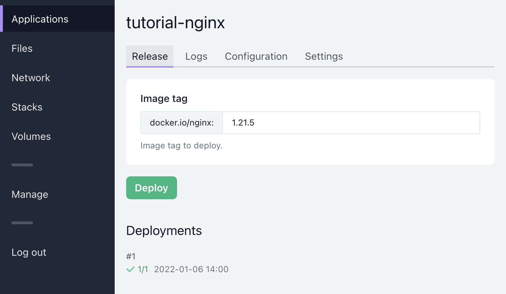

Congratulations! You’ve now deployed an application on Shipmight. The application is ready to accept traffic. We just need to point a domain to it.

## Add domain

> **Note:** You don’t have to own a domain to test this functionality. At the end of the tutorial we’ll show how you can test any domain via `curl`. However, if you own a domain, feel free to point it to your Shipmight installation and use it in this step.

From the sidebar, navigate to **Network** and select **Add domain**.

Fill in the following details:

- **Hostname**  
  Choose the domain. You can use a domain you own or just a random example like `example.com`

- **Target**  
  Select the newly created application from the dropdown.

- **Target port**  
  Type in `80`.

Here’s an example of what the form should look like with these details filled in:

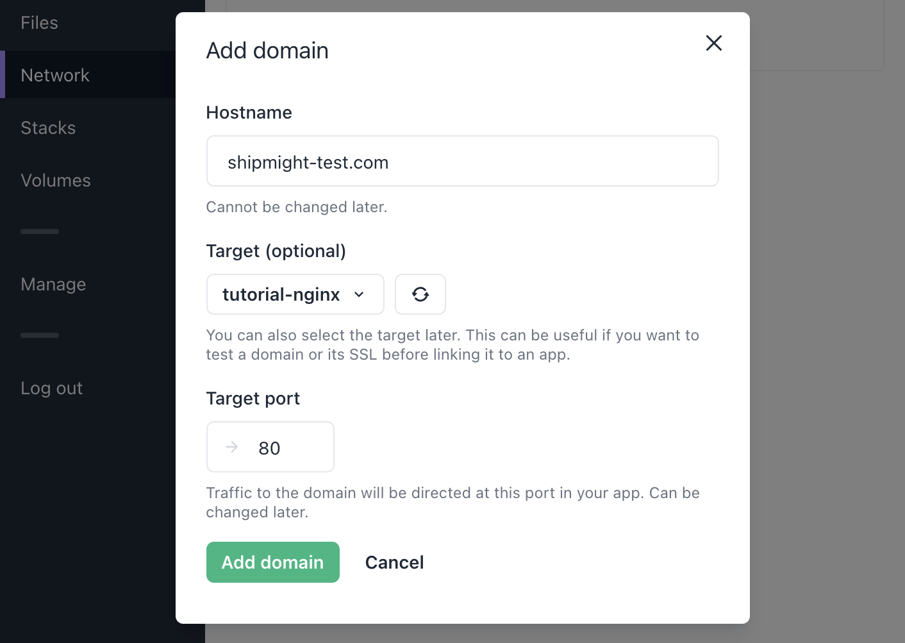

Then select **Add domain**.

After saving you should see a new domain under **Domains**. It takes a moment for the domain to be ready. Wait until it has finished creating.

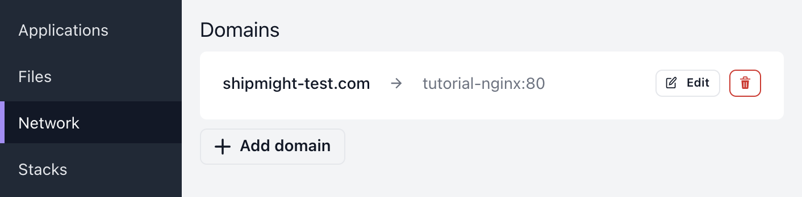

### Test it

If you own the domain and have pointed it towards your Shipmight installation, open the URL in your browser and you should see the HTML page we created earlier:

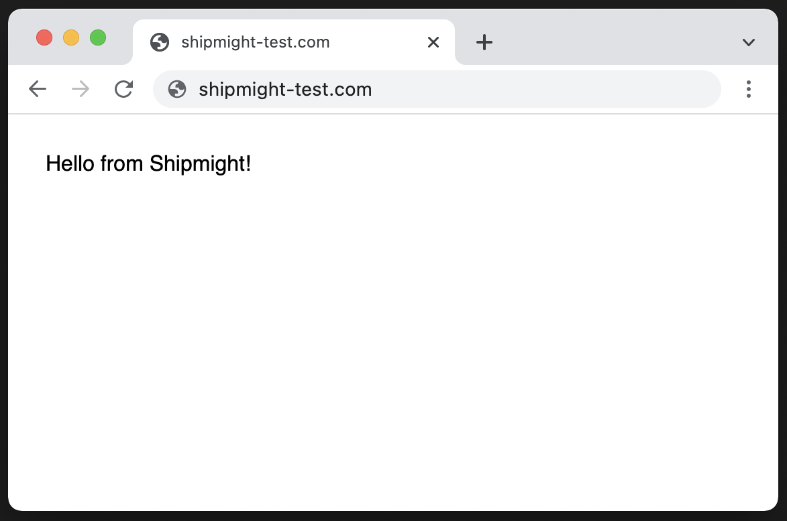

Otherwise you can test that the domain works as expected via `curl`:

```shell
$ curl -H 'Host: <domain>' http://<shipmight-ip>
```

Example:

```shell
$ curl -H 'Host: shipmight-test.com' http://192.168.64.18
<p style="font-family: sans-serif; padding: 20px;">
  Hello from Shipmight!
</p>
```

You’ve now successfully deployed a simple Nginx server at a custom domain.

## View logs

Under the **Logs** tab, you can monitor the application logs in real-time.

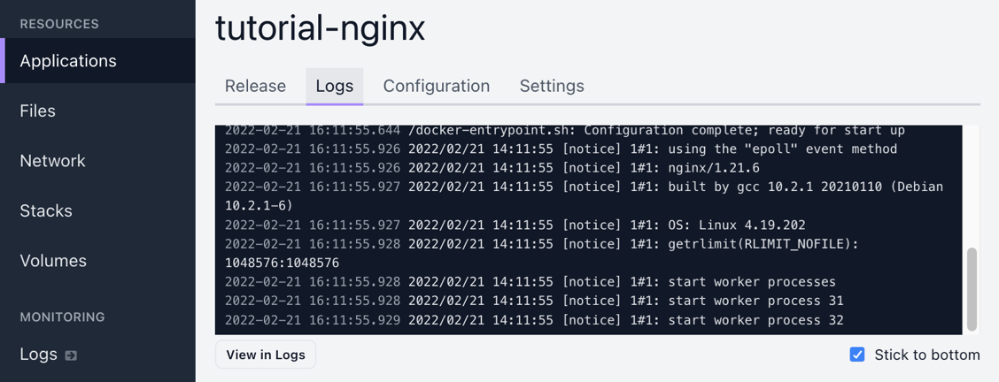

You can also select **View in Logs** to open the full-page log viewer where you’ll be able to view and download log history. See [Logs](Logs.md) for more information on the log viewer.

## Update the page

Under **Files**, you can select the previously created file and update its contents at any time. When you’re ready for the changes to take effect, go back to the **Release** tab and re-deploy the application.

> **Note:** Updating the file does not take effect until you make a new deployment of the app. This way you can prepare updates for an app (e.g. update a file, change environment variables), and when you’re ready, you can trigger a new deployment.

> **Note:** Kubernetes may restart pods at its own, for example to perform maintenance on nodes. This is a feature, not a bug! For this reason, you should not delay making a new deployment for too long, because pending changes in files may go live unexpectedly due to this mechanic.

## Further reading

- [Files](Files.md)
- [Applications](Applications.md)
- [Logs](Logs.md)
- [Domains and SSL](Domains-and-SSL.md)
