# Deploy web app

You can deploy any containerized application on Shipmight. In this tutorial we’ll deploy a web app and publish it at a public domain with automatic SSL.

This tutorial whill show you how to:

- create and deploy an application in Shipmight
- create a domain and point it at the application

Here’s an overview of the resulting architecture:

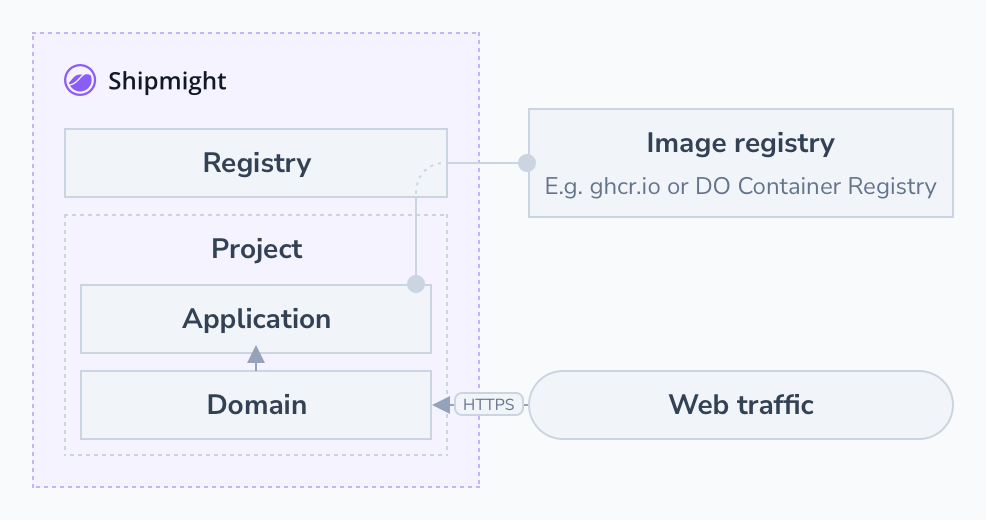

## Prerequisites

You should have a Shipmight installation ready.

Read and write access to an image registry is needed. If you use GitHub, you will be able to use GitHub Container Registry. Cloud providers also provide their own image registry solutions. We’ll touch on this below.

Estimated time to complete this tutorial: X

## Example web app

To demonstrate a web app in this tutorial, we’ll use an extremely simple example application, which simply opens a minimal HTTP server which responds to any request with a JSON representation of a few environment variables. It consists of two files:

```js
// serve.js
const http = require("http");
const requestListener = (req, res) => {
  console.log("Received request!", req.url);
  res.writeHead(200);
  res.end(
    JSON.stringify({
      NODE_ENV: process.env.NODE_ENV,
      DB_URL: process.env.DB_URL,
    })
  );
};
const server = http.createServer(requestListener);
server.listen(8080, () => {
  console.log("Listening!");
});
```

```dockerfile
# Dockerfile
FROM node:16-alpine
COPY serve.js ./
CMD [ "node", "serve.js" ]
```

I’ve built this image and pushed it to a private ghcr.io registry.

## Preparing your application

### Containerizing your application

If you haven’t already, create a Dockerfile in your project.

You can find a suite of Dockerfiles for your programming language of choice from our article: [Common Dockerfiles](/articles/common-dockerfiles).

### Pushing it to a registry

When you have built your image, push it to an image registry.

If you use GitHub already, you can utilize the GitHub Container Registry (ghcr.io). The URL to your image would conform to this format: `ghcr.io/username/image`. We’ve included instructions for adding a ghcr.io auth token to your Shipmight on the [Registries](Registries.md#github-container-registry) page.

Cloud providers also offer image registries as a service. We’ve collected some of them on the [Registries](Registries.md#cloud-providers) page. That page also includes instructions for adding their auth token to Shipmight.

## Create an application

From the sidebar, navigate to **Applications**.

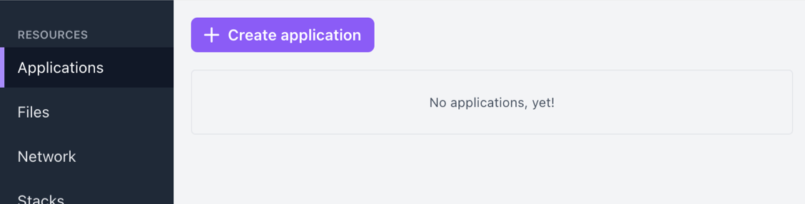

Select **Create application**.

Give the application a name, for example `Tutorial App`.

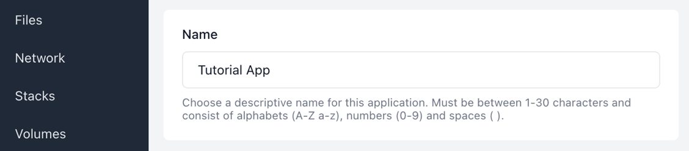

Select your image registry and the image name to pull. Selection of a specific tag will come later, when you make a deployment of the application.

> **Note:** If you haven’t yet, add your container registry to Shipmight under **Manage**. See [Adding a registry](Registries.md#adding-a-registry) for more information.

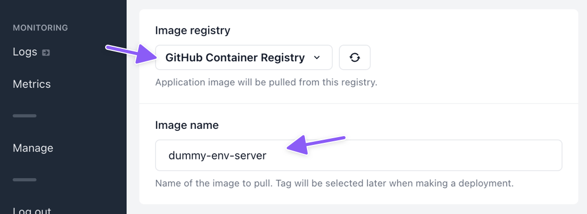

Configure your app by setting environment variables. You can add values such as database connection strings or debug flags. You can also leave this blank if your app doesn’t need any configuration.

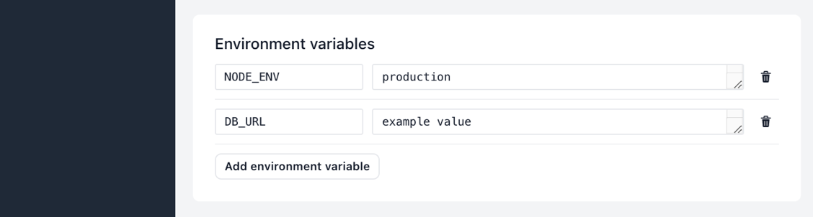

You can also select file mounts for your app. In this tutorial we’ll skip over this step. You can read more about it on the [Deploy single HTML page](Deploy-single-HTML-page.md) tutorial.

You can customize replicas, memory and CPU if needed. We’ll get back to these in a later section of this tutorial.

Finally select **Create application**. You will be redirected to the Release-tab of the newly created application.

## Deploy the application

In the **Image tag** field on the Release-tab, type the version of the image you want to deploy.

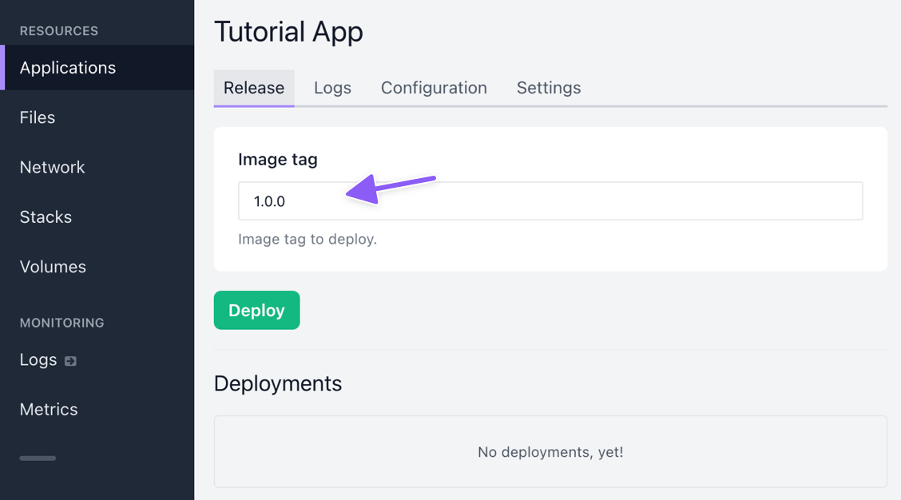

Then select **Deploy**.

You should see a new deployment appear at the bottom of the page.

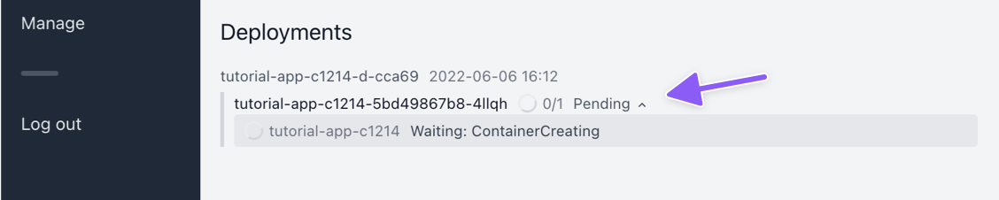

The deployment list shows the status of each pod in the deployment, and also the status of each container in each pod. In this example we only have 1 pod with 1 container, but you would have more if you configured this application to have more replicas.

As you can see, the initial container status is "Waiting: ContainerCreating". This means that Kubernetes is pulling the required images and creating the containers.

Wait until the deployment is ready. It shouldn’t take more than 5 minutes, depending on your network conditions. When the deployment is ready, it will show a green status indicator. The `1/1` indicates that one out of one containers is running.

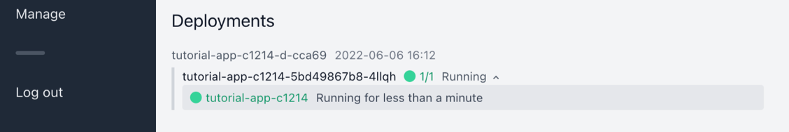

Looking at the **Logs** tab, we can see output from the container:

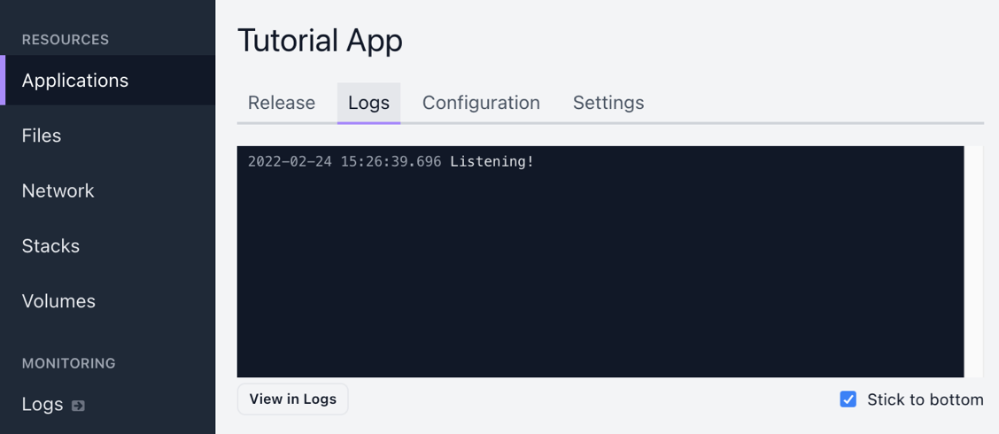

Congratulations! You’ve now deployed an application on Shipmight. The application is ready to accept traffic. We just need to point a domain to it.

## Add a domain

> **Note:** When automatic SSL is mentioned in this section, it is assumed that you have enabled automatic SSL (see [Configuring Cert-Manager](Configuring-Cert-Manager.md)). If you haven’t, don’t worry! You can also follow along without enabling it; your domain will simply not be issued an SSL certificate.

From the sidebar, navigate to **Network** and select **Add domain**.

Fill in the following details:

- **Hostname**  
  Choose the domain. You can use a domain you own or just a random example like `example.com`

- **Target**  
  Select the newly created application from the dropdown.

- **Target port**  
  Type in the port which the application listens to. In the example application it is `8080`.

Here’s an example of what the form should look like with these details filled in:

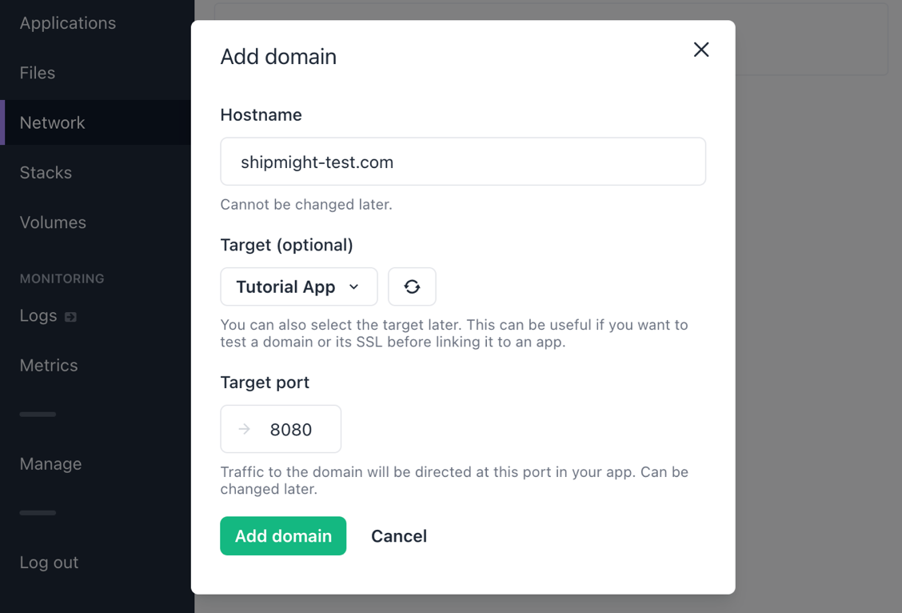

Then select **Add domain**.

After saving you should see a new domain under **Domains**. It takes a moment for the domain to be created.

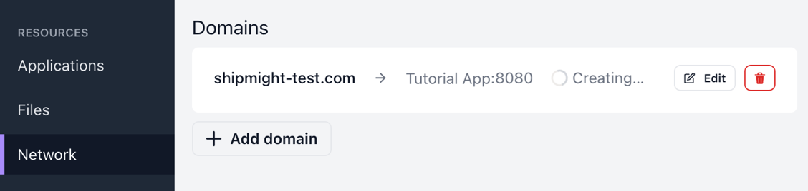

It may take a moment longer for the SSL certificate status to be visible, depending on latency in Let’s Encrypt.

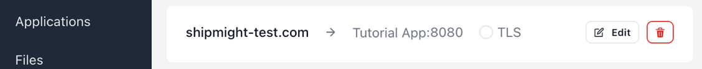

Wait until the domain has finished creating and the certificate is ready.

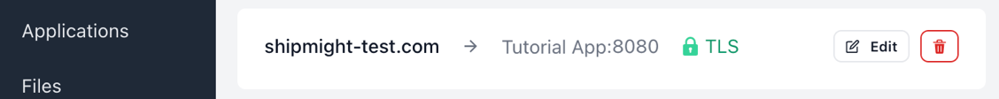

### Test it

If you own the domain and have pointed it towards your Shipmight installation, open the URL in your browser and you should see a response from the application:

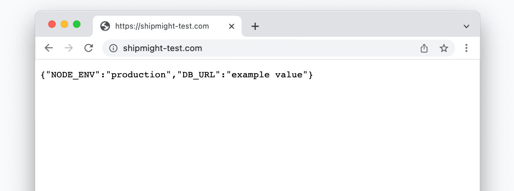

In the screenshot we can also see the environment variable values we set above.

> **Note:** If you don’t own the domain or want to test it before updating your DNS, see [Testing domains](Domains-and-SSL.md#testing-domains) for instructions on how to test.

You’ve now successfully deployed an application at a custom domain!

## Next steps

### Monitor logs and metrics

On the Metrics-page you can monitor CPU and memory usage live. See [Metrics](Metrics.md).

On the Logs-page you can monitor logs from your application containers. See [Logs](Logs.md).

### Scale horizontally or vertically

You can scale the application horizontally and vertically by changing the values for **Replicas**, **Memory** and **CPU** on the **Configuration** tab. After saving your changes, make a new deployment and they will take effect. See [Scaling](Scaling.md).

## Further reading

- [Applications](Applications.md)
- [Logs](Logs.md)
- [Metrics](Metrics.md)
- [Registries](Registries.md)
- [Domains and SSL](Domains-and-SSL.md)
