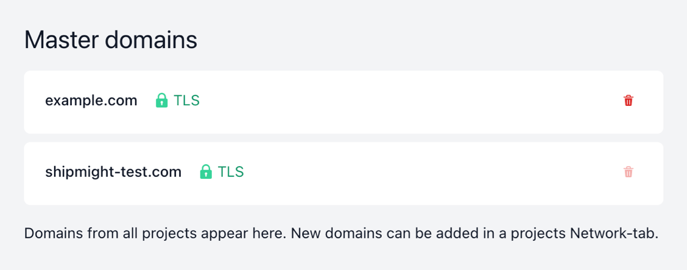

# Domains

Shipmight allows routing traffic to applications from custom domains, with support for automatic SSL (for example via Let’s Encrypt).

## DNS

For each domain you wish to use, add a corresponding DNS record to point it to your cluster.

- Type: `ALIAS`

## Adding domains

On the **Network** page, select **Add domain**.

Fill in the following details:

- **Hostname**  
  Choose the domain. You can use a domain you own or just a random example like `example.com` or `subdomain.example.com`

- **Target (optional)**  
  Select the app to which traffic should be directed. You can leave this empty and set it later.

- **Target port**  
  Select the target port in the app.

Here’s an example of what the form should look like with these details filled in:


Then select **Add domain**.

After saving you should see a new domain under **Domains**.


## Testing domains

You can verify that a domain is routed correctly before pointing the DNS at it.

### Testing a http domain

You can make a simple `curl` request. Just set the `Host` header:

```shell
$ curl -H 'Host: <domain>' http://<shipmight-ip>
```

### Testing a https domain

Testing an SSL-enabled domain is a bit more complicated, but can still be achieved via `curl`:

```shell
$ curl --insecure --connect-to <domain>:443:<shipmight-ip>:443 https://<domain>
```

### Overriding DNS on your machine

> **Note:** Be very careful when editing `/etc/hosts`. You can cause big problems for your machine if the file is misconfigured.

As an alternative, you can override your local DNS by editing the `/etc/hosts`. Note that this only affects your machine. You can force your machine to forward traffic to a hostname to the Shipmight IP by adding a line of format `<shipmight-ip> <domain>` to `/etc/hosts`:

```
# Add the following line to /etc/hosts
<shipmight-ip> <domain>
```

After saving the file, when you make a request to `<domain>` (via curl or in the browser, or anywhere), your machine should ignore DNS and forward the requests to `<shipmight-ip>` instead.

It is recommended to remove this line immediately after you are done testing, so you don’t forget about it.

## Listing domains

On the **Network** page you can view a list of all domains in the project.

## Editing domains

For any domain in the list, you can select **Edit** to open the domain in a modal.

You’ll be able to edit the target and the target port of the domain. The hostname cannot be changed.

## Automatic SSL

If your cluster has been configured with a certificate issuer (see [Configuring Cert-Manager](Configuring-Cert-Manager.md)), Shipmight will automatically enable SSL for domains.

> **Note:** SSL is issued for each hostname once. If you add a domain that has already been added before, the existing SSL certificate will be used.

The status of the certificate is shown next to the domain in the list. Depending on the issuer, it may take a while to be ready.


## Deleting domains

For any domain in the list, you can use the Delete-button to delete it.

A confirmation modal will open, and you will be asked to confirm the deletion.


> **Note:** SSL certificates are not deleted when a domain is deleted. The certificate remains in the cluster, and if you add the domain back, it will be ready for use again.

## Domains without targets

You can add a domain without specifying a target app. This initializes the Ingress and TLS certificate issuance (if enabled) in the cluster. You can use this mechanic to setup TLS for a domain before its traffic is routed to an app. Then when you add a target app, TLS will be ready immediately.

## Master domains

On the Manage-page, you can see all domains from all projects, and their TLS status:



These "master domains" are not specific to any project. They exist for holding TLS information of a hostname. In the future users will be able to add the same domain into multiple projects at the same time while specifying different paths for each instance. This can be especially useful for microservice architecture (one project responsible for `/api`, another for `/checkout`, and so on). Splitting domains into non-project-specific masters and project-specific minions prepares for this upcoming functionality.

### Deleting master domains

If a domain is no longer used in any project, you can delete it from the list.

Deletion is disabled if the domain is still active in some project.

> **Note:** When you delete a master domain, the Kubernetes Certificate is also deleted, but the underlying Secret containing the certificate is not. This is a feature of Cert-Manager (see [discussion](https://github.com/cert-manager/cert-manager/issues/897)). For most users this should never be a problem. If it becomes a problem for you, you can configure your custom Cert-Manager installation to alter this behaviour, or just manually delete old Secrets periodically.

## Kubernetes resources

Behind the scenes the domain is stored as a Kubernetes Ingress in the project namespace.

Additionally a Kubernetes Service is created in the same namespace. If the domain has not been linked to an app, this service contains no `spec.selector`.

For each unique hostname, an additional Kubernetes Ingress is stored in the `shipmight` namespace. This Ingress acts as a “master” Ingress. This way the same hostname can be added by users multiple times.

If an SSL issuer has been configured in the installation, Shipmight adds the required cert-manager annotation to the master Ingress. Cert-Manager will then create Certificates and Secrets, and integrate them to nginx-ingress.
