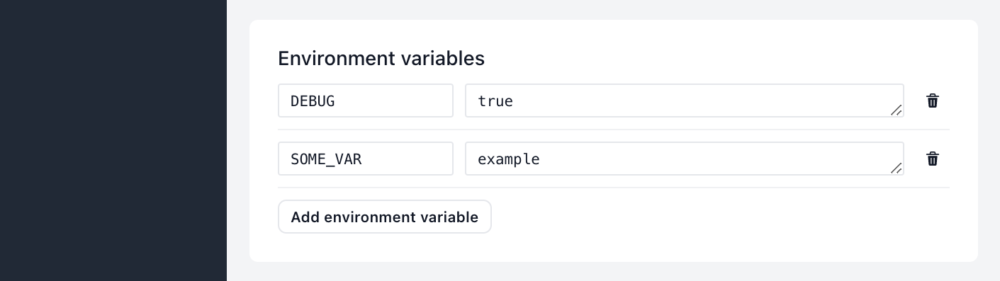

# Environment variables

Most programming languages are able to read values from environment variables. Shipmight supports adding custom environment variables to apps, so you can customize the app behaviour without rebuilding the image.

> **Note:** If you’ve ever set a variable in a Docker container like `-e SOME_VAR=example`, this achieves the same effect.

## Adding environment variables to apps

When creating or editing an app, you are able to add, edit and remove environment variables:



Each environment variable consists of two fields:

- **Name**  
  Must be 200 characters or less, and consist of uppercase letters (`A-Z`), numbers (`0-9`) and underscores (`_`).

- **Value**  
  Must be 200 characters or less. Can contain newlines.

## Reading environment variables

Most programming languages include built-in support for reading environment variables. Some examples:

```bash
# bash
$SOME_VAR
```

```js
// js
process.env.SOME_VAR;
```

```python
# python
os.environ.get('SOME_VAR')
```

```ruby
# ruby
ENV['SOME_VAR']
```

```golang
// golang
os.Getenv("SOME_VAR")
```

Refer to the manual of your programming language of choice if it wasn’t listed here.

## Customizing Docker Hub images

Most Docker images you can install from Docker Hub come with a set of environment variables for customization. For example, the [`postgres`](https://hub.docker.com/_/postgres) image allows you to configure authentication details with variables like `POSTGRES_USER` and `POSTGRES_PASSWORD`.

Refer to the documentation of the Docker image you are using to see the available options for that image.

## Kubernetes resources

Environment variables are added directly to the `containers.env` array of the Kubernetes Deployment.
