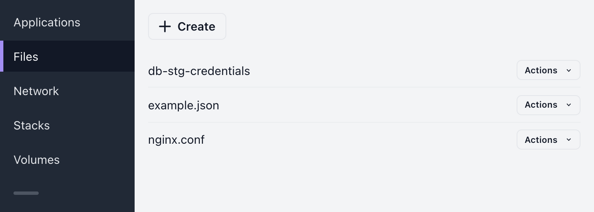

# Files

Files are pieces of content which can be mounted inside apps. They can be mounted to several apps at a time, which makes them useful for storing e.g. credentials that must be shared across apps. They are also useful for supplying configuration files to services inside the containers.

> **Note:** If you’ve ever mounted a file in a Docker container via `-v /path/to/data.json:/app/data.json`, this is pretty much the same thing.

## Creating files

On the **Files** page, select **Create file**.

On the Create file -page you can specify.

- Name  
  Descriptive name for the file. You can change this later.

- File content  
  Contents of the file. You can edit this later.

> **Note:** when mounting files in apps, you will be able to select a specific file name for every occasion. It will not be forced to use the name you’ve chosen here. So, no need to stress over the name at this point, just make it descriptive.

## Listing files

On the **Files** page you can view a list of all files in the project.

## Editing files

On the **Files** page, click a file name to open it in the editor.

You’ll be able to edit the name and the contents of the file.

> **Note:** editing a file does not automatically update it in any apps where it’s been mounted. Changes will be reflected upon the next deployment of the app, which you can trigger manually when you want to make the changes effective. Keep in mind that deployments may also be recreated by the Kubernetes distribution at random times; in this case the file contents will also be updated.

## Syntax highlighting

When creating or editing a file, you can also select from various syntax highlighting options.

If your file name contains a recognized extension (e.g. `.json` or `.xml`), the applicable syntax highlighting option will be automatically selected. You can override this selection from the dropdown if necessary.

## Mounting files to apps

You can mount files to specific paths in applications, services and jobs. The same file can be mounted to multiple apps at once.

When creating or editing an app, select a file from the dropdown:

Then choose the absolute path where it’ll be mounted, including file name. File name does not have to match with the actual file name; for example, if your file is called `data.json`, you can mount it at `/example/foobar.json`.

## Mounting a file to multiple apps

The same file can be mounted to multiple apps at once.

For example, you can create a file called `db-connection-string.txt` and mount it to several apps. This way you can keep database credentials in one place.

## Deleting files

On the **Files** page you can select **Actions** → **Delete file** to delete it.

A confirmation modal will open, and you will be asked to confirm the deletion.

## Kubernetes resources

Behind the scenes Shipmight stores the file as a Kubernetes Secret in the project namespace.
