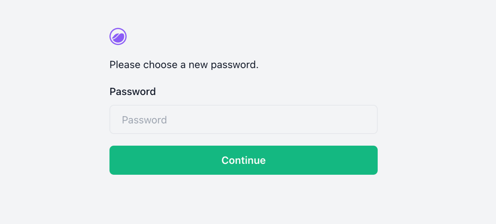

# First steps

These are the first things to do with your new Shipmight instance.

## Set a new admin password

Upon installation, Shipmight creates a default `admin` user which you can use to log in.

The default credentials are:

- Username: `admin`
- Password: `admin`

When you first log in, you will be prompted to set a new password.

## Add registries

Out of the box you have the ability to deploy images from Docker Hub. If you intend to deploy from private registries, you should add them on the **Manage** page.

See [Registries](Registries.md) for instructions.

## Enable log management

Shipmight integrates with Grafana Loki which offers persistent log storage. Loki is included in Shipmight stack, but it's not enabled by default.

See [Configuring Loki](Configuring-Loki.md) for instructions.

See [Logs](Logs.md) for information about log management features.

## Enable automatic SSL

Cert-Manager can issue and renew SSL certificates for your domains automatically. Cert-Manager is included in Shipmight stack, but it's not enabled by default.

See [Configuring Cert-Manager](Configuring-Cert-Manager.md) for instructions.

See [Domains and SSL](Domains-and-SSL.md) for information about log management features.
