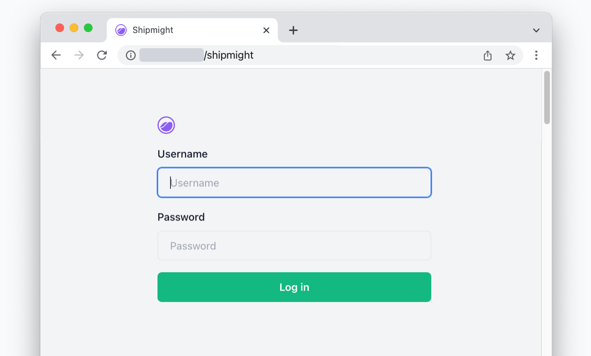

# Installation

Shipmight can be installed to any Kubernetes cluster via the [official Shipmight Helm chart](https://github.com/shipmight/helm-charts).

## Step 1: Get the chart

Add the official Shipmight chart repository:

```bash
helm repo add shipmight https://shipmight.github.io/helm-charts
```

Update your local chart cache:

```bash
helm repo update
```

## Step 2: Install

Install Shipmight via Helm:

```bash
helm install shipmight shipmight/shipmight-stack \
  --namespace shipmight \
  --create-namespace
```

To enable integrations, refer to guides:

- To enable log management, see [Configuring Loki](Configuring-Loki.md)
- To enable automatic SSL certificates, see [Configuring Cert-Manager](Configuring-Cert-Manager.md)
- To enable live metrics, see [Configuring Metrics Server](Configuring-Metrics-Server.md)

## Step 3: Open in browser

Navigate to `<cluster-ip>/shipmight` on your browser, and you should see the login screen:



Log in via the defaul credentials (`admin` / `admin`) and enjoy shipping!

## What next

See [First steps](First-steps.md).

## Updating Shipmight

See [Updating Shipmight](Updating-Shipmight.md).
