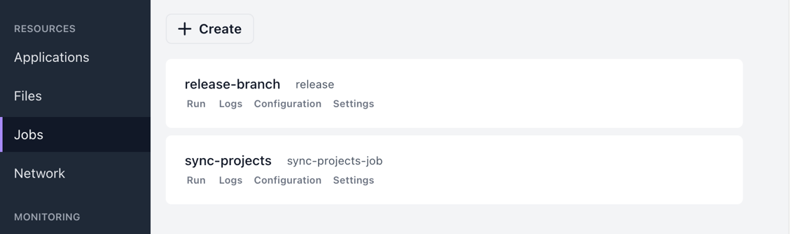
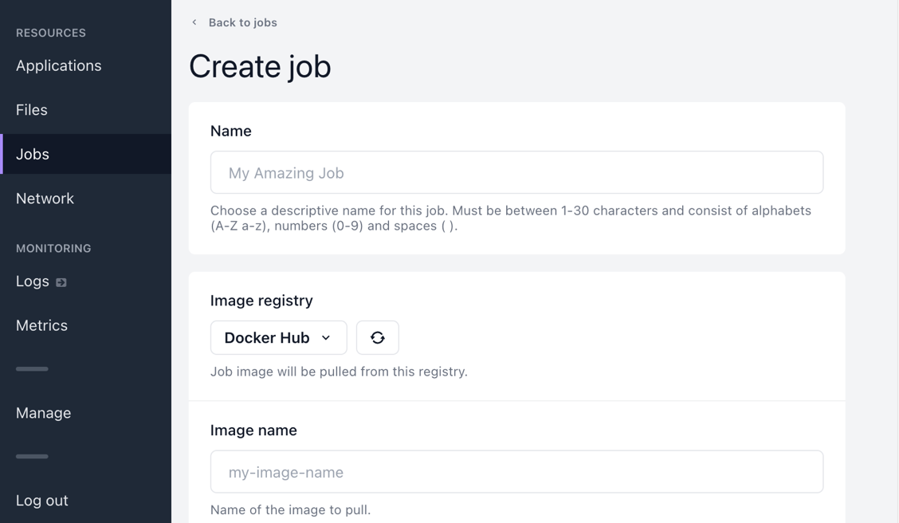
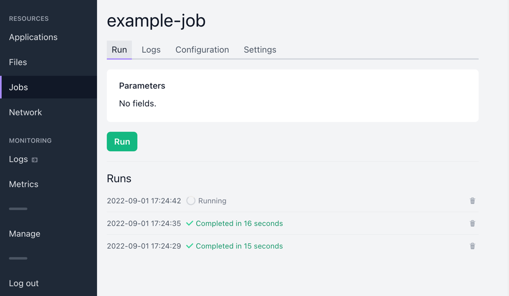
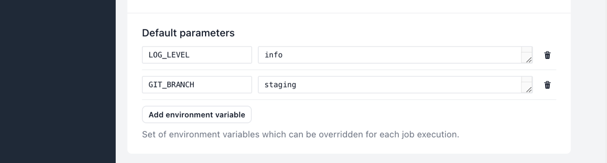
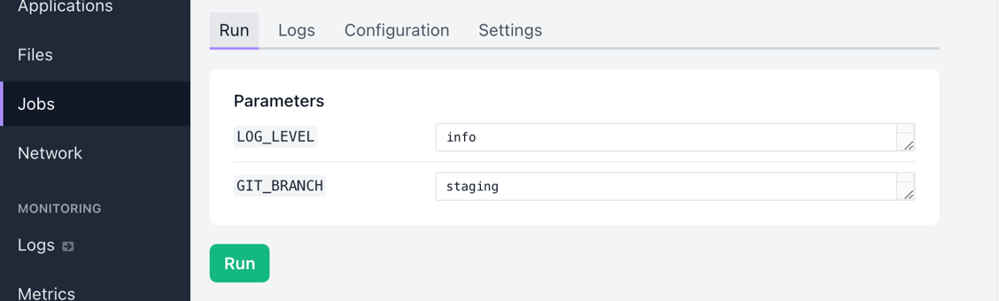

# Jobs

Jobs are one-off tasks triggered by a user or via a deploy hook.

## Listing jobs

On the **Jobs** page you can view a list of all jobs in the project.

## Creating jobs

On the **Jobs** page, select **Create job**.

You can select the container registry, image and tag, mount files into the container and select memory and CPU allocation.

Additionally you can specify static environment variables, and a set of environment variables to act as an overridable preset for job runs. See [Job parameters](#job-parameters).

You can also set a timeout to job runs, and enable auto-deletion of finished job runs after a certain amount of time.

Creating an job does not immediately trigger it. See [Triggering a job](#triggering-a-job) below.

## Triggering a job

### Manually

On the **Run** tab you can manually trigger the job.

### Via a deploy hook

You can also use a deploy hook to trigger a job. See [Deploy hooks](Deploy-hooks.md).

## Job parameters

Under **Configuration** tab, it is possible to choose a set of environment variables under **Default parameters**.

Variables defined in Default parameters will appear on the Run-tab, and their values can be customized for each run.

## Deleting job runs

Individual job runs can be deleted in the UI by selecting **Delete run**.

As mentioned above in [Creating jobs](#creating-jobs), you can also configure an auto-deletion time threshold for each job.

## Viewing job logs

See [Logs](Logs.md).

## Kubernetes resources

Behind the scenes the job is stored as a Kubernetes Secret.

When the job is triggered, Shipmight deploys the job as a Helm release. The Job-manifest in the chart contains the `"helm.sh/resource-policy": keep` annotation. Therefore, when the release is upgraded (triggered again), old Jobs remain in the cluster. They can be deleted by the user via the UI, or they can be cleaned up by auto-deletion if the user has set a time under job configuration in the UI.
