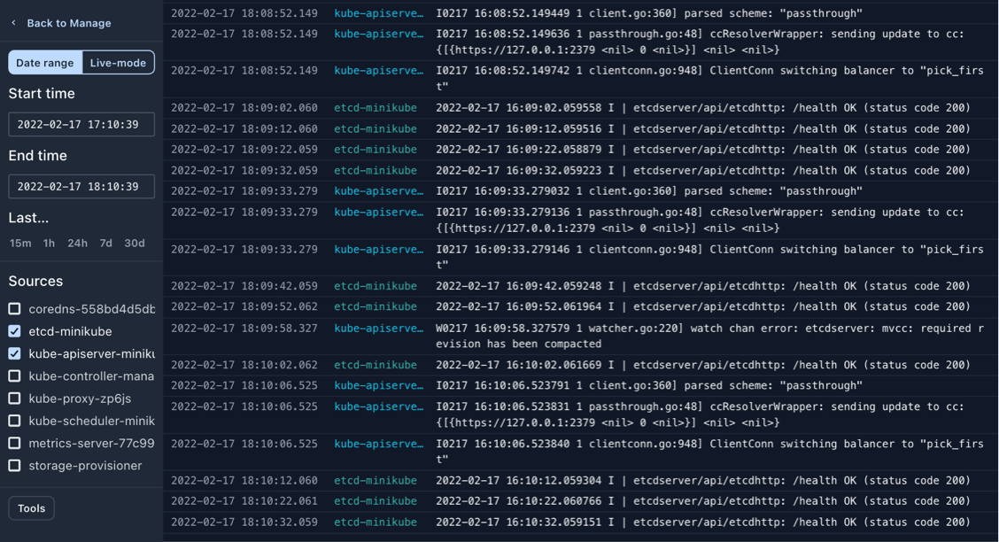

# Logs

Shipmight includes a built-in log viewer interface, which can be used to monitor your apps. Option to download logs easily is also provided.

> **Note:** Browsing logs requires that Loki is installed in the cluster. See [Loki](Loki.md) for instructions. When Loki is not installed, some of the features below are hidden or disabled.

## Viewing logs

From the sidebar, select **Logs**. You will be redirected to a full-page log viewer:

From the left sidebar, you can adjust the time range and the apps for which you would like to view logs.

## Live-mode

In addition to selecting a date range, you can select the Live-mode, which will show the latest logs and pull in any new logs every second.

## Downloading logs

Sometimes you need to download logs for further processing. Shipmight includes this option as well.

From the sidebar, select **Tools**, which will open a modal:

In the modal you can make similar date range and source selections as before. Selections in the modal don’t affect the selections outside the modal.

You can also choose from two output formats:

- **CSV**  
  Comma-separated data, no header. File extension: `.csv`

- **Newline delimited JSON**  
  Each line contains a JSON object. File extension: `.ndjson`

Downloaded files contain 4 columns: `datetime`, `nanoseconds`, `source`, `text`

## Viewing system logs

In addition to browsing app logs, Shipmight makes it easy to view and download logs for internal services in the cluster.

Under **Manage**, you can find two options for monitoring system logs.

- **Shipmight logs**  
  Logs from Shipmight stack containers, such as the Shipmight API, Loki and ingress-nginx.

- **kube-system logs**  
  Logs from containers in the kube-system namespace. The exact containers vary from Kubernetes distribution to distribution, but generally you can find containers like etcd (the key-value database used by Kubernetes) or the api-controller. All containers in kube-system relate to the internal workings of Kubernetes, and are not managed by Shipmight.

Selecting either option opens the full-screen log viewer interface.

Browsing these logs can be useful for troubleshooting.
