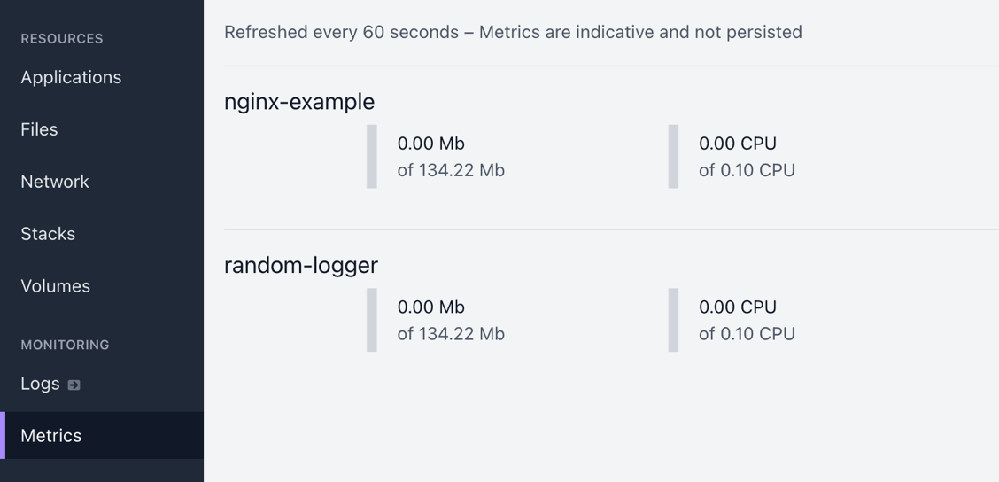
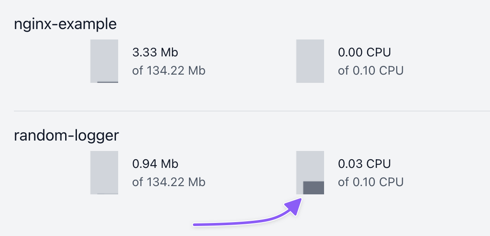

# Metris

## Viewing live metrics

From the sidebar, you can find **Metrics** which will display live resource metrics for all apps in the project.

For each app, you can see the following metrics:

- **Memory usage**
- **Memory limit**
- **CPU usage**
- **CPU limit**

If an app does not have active deployments, no metrics will be visible.

These metrics are queried live from Kubernetes and updated once every 60 seconds.

While you keep the tab open, a graph is being drawn over time. If you refresh the page or close the tab, the graph will reset.

## Persistent metrics

At the time of writing, Shipmight does not include persistent storage for metrics, which means that history data is not available. Metrics on the metrics-view are fetched in real time while the browser tab is open, and discarded when you close the tab.

There are various options for monitoring a Kubernetes cluster in a more persistent fashion.

### Prometheus

> **Note:** Installing the following dependencies requires knowledge about managing persistent storage. Only proceed if you are comfortable with this requirement.

Prometheus is not included in Shipmight stack, because it does not support an infinitely scalable storage back-end, like Loki does. Therefore installing it requires some upfront knowledge from the user about the specific usecase, for which we can’t provide a one-size-fits-all configuration, unfortunately.

However, there is no reason why you couldn’t install Prometheus in your cluster. It will not conflict with Shipmight in any way.

### Cloud provider metrics

Several cloud providers offering managed Kubernetes clusters also include some way of monitoring the cluster. Refer to your cloud provider documentation for this usecase.

### Using a third-party monitoring tool

There are a lot of monitoring offerings for Kubernetes. Usually they involve just installing an agent to your cluster. There is no reason why you couldn’t install such third-party monitoring tools to your cluster. Shipmight will not complain nor conflict.
