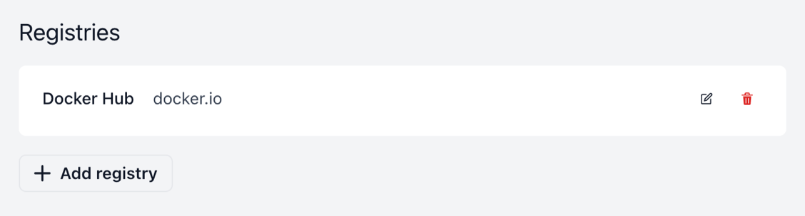
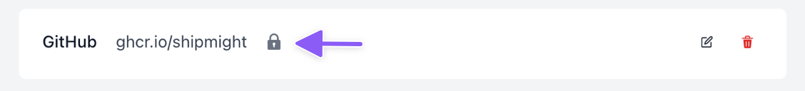
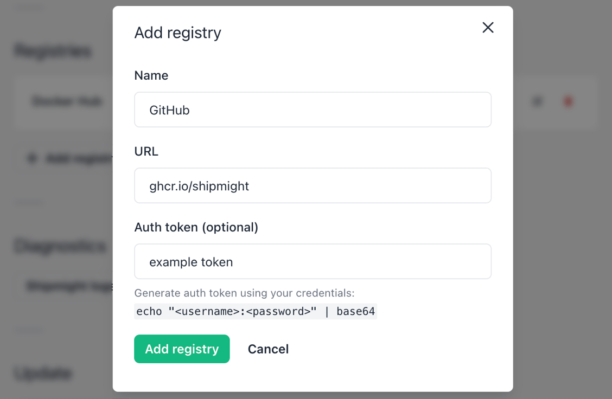
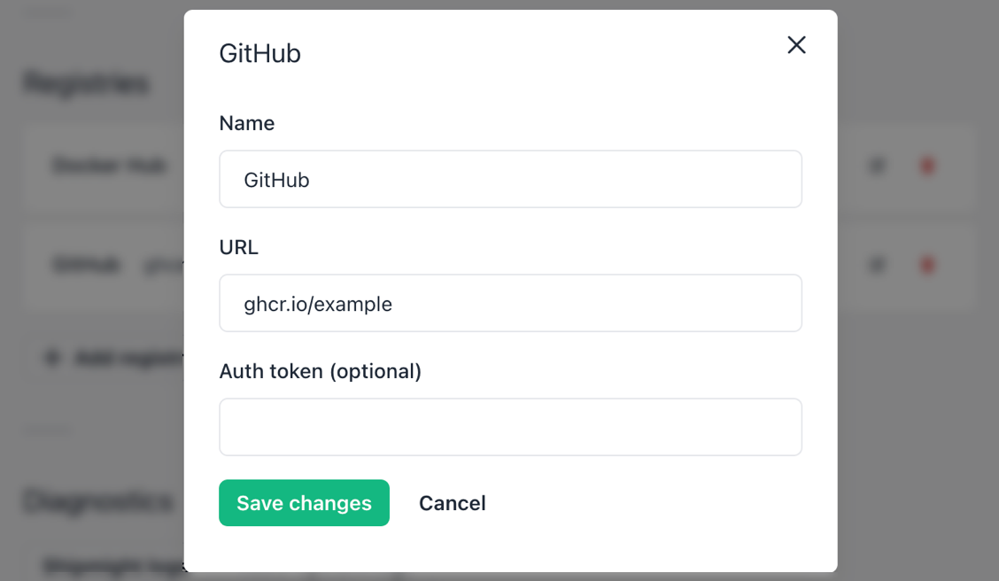
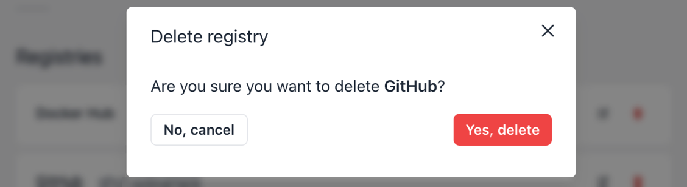
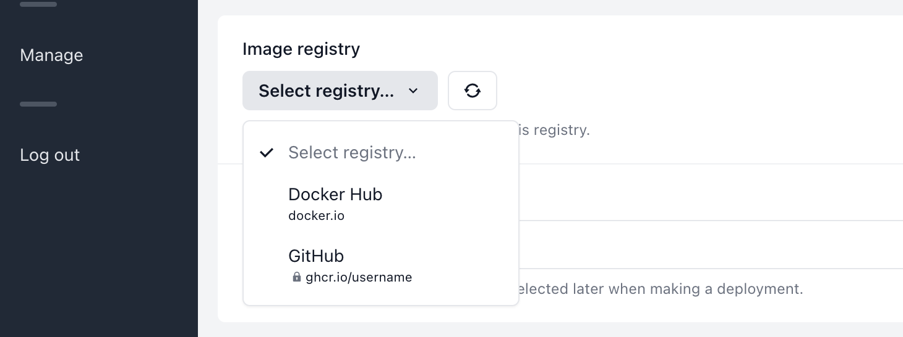

# Registries

Shipmight allows pulling app images from public registries like Docker Hub, as well as from private registries with an auth token.

Adding a registry in Shipmight creates a link between Shipmight and the registry, including the optional auth token if needed. Through this link Shipmight can pull images from the registry.

## Viewing registries

On the **Manage** page, you can see a list of the currently installed registries. By default you will find Docker Hub there.



When you add private registries, they will have a lock-icon next to them indicating authentication credentials.



## Adding a registry

Select **Add registry**.

Fill in the following details:

- **Name**  
  Give a descriptive name for this registry.

- **URL**  
  URL of the repository, e.g. `ghcr.io/username` or `quay.io/organization`. When this registry is used in an app, the image name is appended to the URL, delimited by a slash. Final image pulled by the container is of format `<registry-url>/<app-image-name>:<deployment-image-tag>`.

- **Auth token (optional)**  
  If the registry requires authentication, copy the auth token here.

Here’s an example of what the form should look like with these details filled in:



Then select **Add registry**.

After saving you should see a new registry in the list. It is ready to be used in new apps immediately.

### Finding the auth token

#### Cloud providers

You may not need an auth token if your cluster and registry are hosted on the same provider.

We’ve provided additional instructions for using the following cloud providers’ registry solutions:

- [DigitalOcean Container Registry](DOKS.md#using-digitalocean-container-registry)

#### GitHub Container Registry

For GitHub Container Registry (ghcr.io), first [obtain a Personal Access Token](https://docs.github.com/en/authentication/keeping-your-account-and-data-secure/creating-a-personal-access-token#creating-a-token) with the following scopes: `read:packages`. Then encode your username and PAT together, separated by a colon:

```shell
$ echo "github_username:personal_access_token" | base64
Z2l0aHViX3VzZXJuYW1lOnBlcnNvbmFsX2FjY2Vzc190b2tlbgo= # <- this is your auth token
```

See [GitHub documentation](https://docs.github.com/en/packages/working-with-a-github-packages-registry/working-with-the-container-registry#authenticating-to-the-container-registry) for more information.

#### Other registries

For most registries, the auth token can be composed by encoding a username and a password, separated by a colon:

```shell
$ echo "username:password" | base64
PHVzZXJuYW1lPjo8cGFzc3dvcmQ+Cg==
```

Note that one of these values may be left empty, or may be an API token. Check with your registry provider for further instructions.

## Editing a registry

For any registry in the list, you can use the Edit-button to make changes.



If the registry already had an auth token, you can choose whether you’d like to update it or leave it unchanged. The existing auth token is not visible in the UI.


## Deleting a registry

For any registry in the list, you can use the Delete-button to delete it.

A confirmation modal will open, and you will be asked to confirm the deletion.



### Restoring Docker Hub

If you’ve deleted Docker Hub in the past but need it again, you can quickly add it back via the “Add Docker Hub” button.


## Using registries in apps

When creating or editing an app, you can select the registry from which the app image will be pulled:



## Kubernetes resources

Behind the scenes Shipmight stores the registry as a Kubernetes Secret in the `shipmight` namespace.

A copy of the Secret is copied over to any project namespaces where an app needs to use it to pull images.
