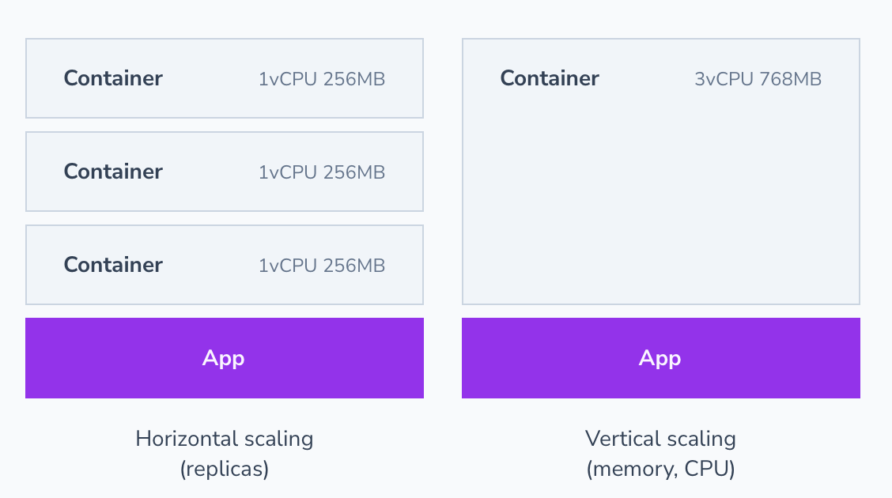
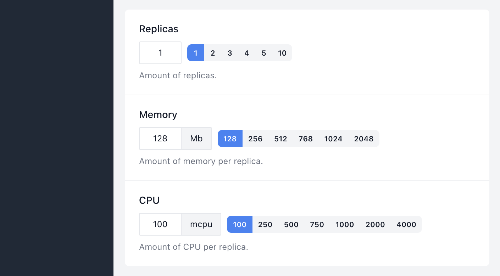

# Scaling

Shipmight allows you to take advantage of replication and resource requests/limits in a Kubernetes cluster.

You can scale apps horizontally (replicas) and vertically (memory, CPU).

## Manual scaling

When creating or editing an app, you can specify scaling options:

The following fields are available:

- **Replicas**  
  Amount of replicas of the container to deploy. Incoming traffic is divided between all replicas.

- **Memory**  
  Memory per container, in megabytes.

- **CPU**  
  CPU per container, in milliCPU (1,000 mcpu = 1 cpu)

## Cluster resources

Note that if you assign more memory or CPU to apps than there is available in the cluster, apps will not be able to deploy. They will instead get stuck in a waiting-state. You can resolve the situation by scaling up the cluster or by scaling down apps.

## Kubernetes resources

Amount of replicas controls `spec.replicas` in the Deployment.

Memory and CPU values control `containers.resources`. Same value is set to `limits` and `requests`.
