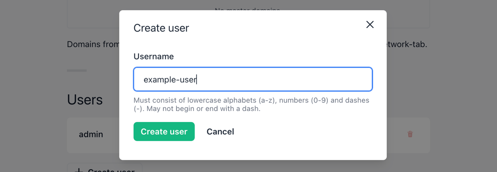
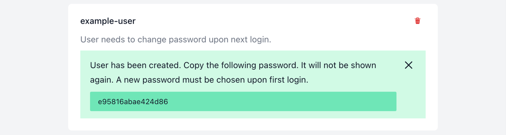
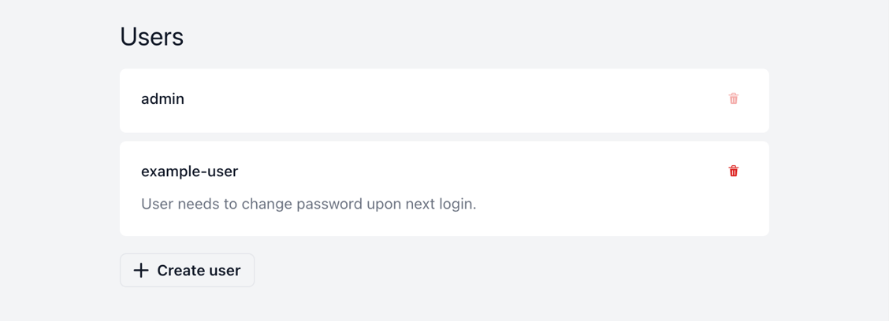
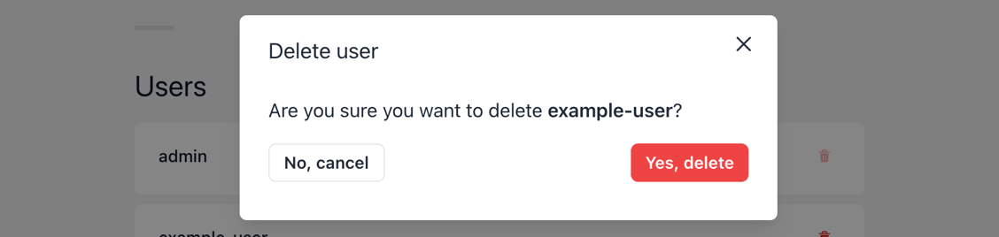

# Users

## Default user

Upon installation Shipmight creates a default user with the username `admin` and the password `admin`. Upon first login the password must be changed.

The default username and password can be configured via the Helm chart, see [Initial user and password](Configuring-Shipmight.md#initial-user-and-password).

## Adding users

On the Manage-page, select **Create user** to create a new user:

After creation you will be able to copy their randomly generated password. They will need to choose a new password upon the first login.

## Listing users

You can find the list of users on the Manage-page.

## Deleting users

For any user in the list, you can use the Delete-button to delete it.

A confirmation modal will open, and you will be asked to confirm the deletion.

> **Note:** You cannot delete your own user, because there needs to always be at least one existing user.

## Kubernetes resources

Each user is stored as a Kubernetes Secret.
