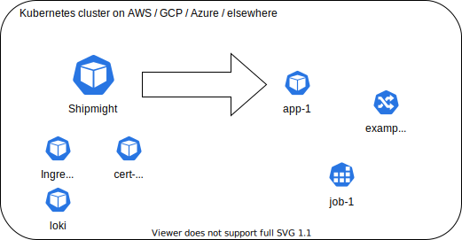
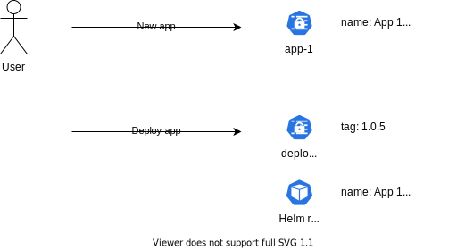
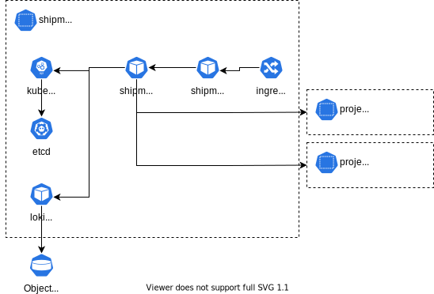

# What is Shipmight

The complete overview.

## Introduction

This document exists as a resource for those who wish to learn what Shipmight is and what it is capable of. This document also uncovers many of the technical aspects and choices of Shipmight on a general level, so after reading it you should understand how Shipmight operates Kubernetes.

## Who is Shipmight for

With Shipmight, developers can have a PaaS experience in the cloud of their choice. Shipmight eases the learning curve of Kubernetes.

With Shipmight, DevOps-personnel can lessen the burden of maintaining deployment infra for their teams. Instead of providing teams with custom scripts and documentation, the dev team will be happy to have a private graphical PaaS. You don’t give up flexibility or the power of Kubernetes; you still keep control of the cluster.

With Shipmight, companies can enhance developer productivity by reducing the need for DevOps hurdles. Companies can also reduce the vendor lock-in caused by DevOps consultancies’ custom scripts and practises.

## Introduction to Kubernetes

If you are new to Kubernetes, we’ve written an article to help you get onboard:

- [Introduction to Kubernetes](Introduction-to-Kubernetes.md)

Hint… it can be useful even for more experienced users!

## Shipmight installs into any Kubernetes cluster

Shipmight can be thought of as a graphical interface for Kubernetes. Shipmight creates, manages and operates Kubernetes resources for you.

Shipmight is first installed into an existing Kubernetes cluster. Then, as the user, you open the Shipmight UI and start creating apps, files, domains, etc. Shipmight will handle the dirty-work of creating and submitting requests to Kubernetes. Kubernetes creates those resources and in the Shipmight UI you can monitor them and make changes to them.

Shipmight does not have a central database. All resources you create in Shipmight UI are stored as Kubernetes resources (usually as Kubernetes Secrets). This way Shipmight scales seamlessly along with your Kubernetes cluster.

Shipmight also integrates with a variety of third-party tools which are widely used in Kubernetes installations, such as cert-manager and ingress-nginx. More on this later.

## Relying on Kubernetes as a data store

And scaling with it.

Shipmight does not require a database, because Kubernetes already ships with one (etcd). When you create and edit resources via Shipmight, those resources are simply stored as Kubernetes resources, backed by the underlying etcd database used by Kubernetes itself.

This comes with advantages, such as the fact that when you scale up your cluster, you scale up Shipmight’s data store. You also don’t have to worry about persistent volumes or outside hosting for Shipmight’s data. For the users, it is assuring that the data you see in the UI comes directly from Kubernetes itself.

There are disadvantages too. Because the API for Kubernetes’ data store is a stateless REST API, it lacks things like foreign key constraints, transactions and auto-increment keys, which you would find in any relational database, for example. The cost of these disadvantages is the need to write more resilient code.

As for log storage… Shipmight defaults to the wonderful Grafana Loki, which can use an S3-compatible object storage bucket as its data store. Thus, you don’t need to worry about databases there either. More on this later.

## Applications, services, jobs

Shipmight makes it easy to deploy all the building blocks of a web application: applications, services and jobs.

Applications are stateless deployments, for things like web servers. They are deployed as Kubernetes Deployments, and support replication.

Services are stateful deployments, for things like databases. They are deployed as Kubernetes StatefulSets, and support volume mounts but no replication.

Jobs are one-off jobs, which can be scheduled like cronjobs or triggered manually when needed. They are deployed as Kubernetes Jobs.

Collectively these types of resources are called apps. Under the hood Shipmight also calls them apps. Each of them is an internal Helm chart, stored in the Shipmight codebase.

When you create an app, Shipmight creates a secret containing the apps information.

When you deploy an app, Shipmight creates another secret with the deployment information, and also triggers a new release of the Helm chart. The chart is deployed with both the app and the deployment information merged.

This architecture allows, among other things, users to make changes to an app without necessarily deploying it at the same time. This makes it nicer to configure things since you are fully in control.

## Files, domains, registries

In addition to user-defined apps, Shipmight supports managing special resources which are needed for regular app deployments.

Users can create files, which have a name and some content. These files are stored as Kubernetes Secrets, and can be mounted to apps.

Users can add domains. Domains are stored as Kubernetes Secrets and an Ingress, and can be mounted to apps. Also, when cert-manager has been configured, Shipmight adds the related annotations to Ingress-objects, thus enabling automatic SSL certificate creation for domains.

Users can add public and private image registries to pull images from.

## Integrations

Shipmight integrates with several building blocks of the common Kubernetes cluster.

When your cluster has Metrics Server installed, Shipmight shows live container metrics in the UI. Metrics-server is included by default in the Shipmight stack.

When your cluster has cert-manager and an Issuer, Shipmight will add the related annotations to Ingress-objects. This allows for automatic SSL certificates.

Shipmight relies on Ingress-NGINX for ingress management. Ingress-NGINX is included by default in the Shipmight stack.

Shipmight relies on Grafana Loki for log ingestion and management. Grafana Loki is included by default in the Shipmight stack. Loki supports S3 storage, which removes many worries because it scales infinitely. Of course, you can install any adjacent log ingestion agents to your cluster too.

In fact, because in the end you are in charge of the cluster, you can install anything you need on it. If you want a third-party monitoring solution for your cluster, or an in-house log ingestion system, there is nothing stopping you from installing those into the cluster too.

## Architecture

Overview of Shipmight components and related APIs:

Shipmight API is a HTTP REST API which is the heart of all Shipmight operations. Resources are created and managed via HTTP calls. The API implements JWT-authentication and -authorization. The API contains a simple in-memory queue for performing certain asynchronous tasks, such as upgrading Helm releases.

The API calls the Kubernetes API directly to create and manage Kubernetes resources. The Kubernetes API acts also as the main data store for Shipmight.

The API also calls the Loki API to fetch logs to the user to view. Loki stores log data in an object storage outside the cluster.

The API creates project-specific namespaces and deploys project-specific resources (apps, files, domains) to them, as requested by the user via the UI.

It’s worth noting, that the Shipmight API is being developed solely for the purposes of the UI, and therefore it is not guaranteed to be stable. Do not use it for custom purposes, unless you are willing to bear the risk of things breaking.

Shipmight UI is a web interface which directly calls the Shipmight API (there is no BFF in-between). The UI does not implement any type of authentication, is relies on JWT-authentication from the API. The UI is a single page web app built with React, as you’d expect.

The Shipmight UI is exposed to the public via an Ingress.

## Further reading

Hopefully this article has given you a good overview of Shipmight.

Continue reading via the more specific articles from the sidebar on the left.
